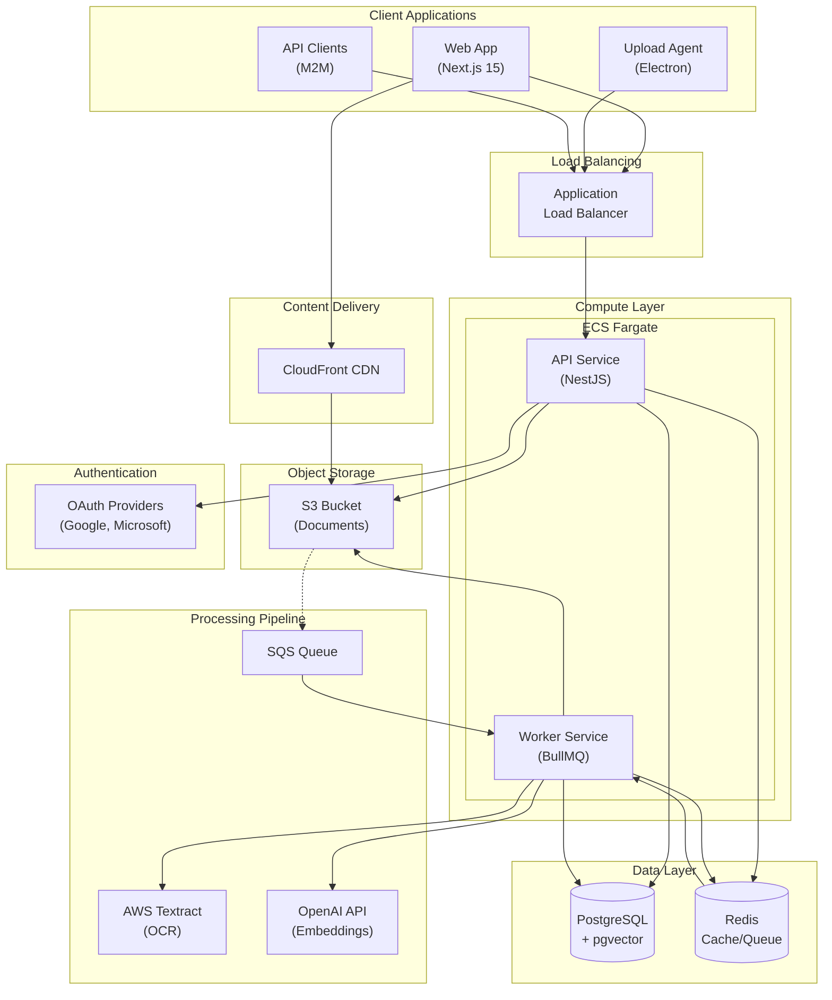

# Document Management System (DMS)

> Cloud document platform with AI OCR (AWS Textract), pgvector semantic search,
> and real-time collaboration, in a Next.js 15 + NestJS 11 Turborepo monorepo.

[](https://github.com/willianpinho/document-management-system/actions/workflows/ci.yml)
[](./LICENSE)


Cloud-based Document Management System with AI-powered document processing,
real-time collaboration, and enterprise-grade security.

## Architecture



See [docs/ARCHITECTURE.md](docs/ARCHITECTURE.md) for the full diagram set
(component architecture, data flow, and deployment topology) and
[docs/DIAGRAMS.md](docs/DIAGRAMS.md) for the processing-pipeline and
semantic-search flows.

## Features

### Core Features

- **Document Storage**: Secure cloud storage with versioning on AWS S3
- **Document Processing**: PDF split/merge, OCR (AWS Textract), AI
  classification
- **Semantic Search**: AI-powered document search using pgvector embeddings
- **Multi-tenancy**: Organization-based data isolation with Row-Level Security

### Collaboration

- **Real-time Presence**: See who's viewing documents in real-time
- **Comments & Discussions**: Threaded comments with @mentions
- **Document Sharing**: Share documents with granular permissions
- **Version History**: Track all document changes with version control

### User Experience

- **Modern Web UI**: Next.js 15 with App Router and React 19
- **Drag-and-Drop Uploads**: Intuitive file upload with progress tracking
- **Resumable Uploads**: Large file uploads with automatic resume
- **Bulk Operations**: Select and manage multiple documents at once
- **Desktop Upload Agent**: Electron app for automated folder syncing

### Security & Auth

- **OAuth Integration**: Google and Microsoft SSO support
- **Email/Password Auth**: Traditional authentication with password reset
- **RBAC**: Role-based access control (Viewer, Editor, Admin, Owner)
- **API Keys**: Machine-to-machine authentication for integrations

## Tech Stack

| Layer           | Technology            | Version |
| --------------- | --------------------- | ------- |
| Frontend        | Next.js (App Router)  | 15.5    |
| UI Components   | shadcn/ui + Radix     | Latest  |
| Backend         | NestJS                | 11+     |
| Database        | PostgreSQL + pgvector | 16+     |
| ORM             | Prisma                | 5.22    |
| Cache           | Redis                 | 7+      |
| Queue           | BullMQ                | 5+      |
| Storage         | AWS S3 + CloudFront   | -       |
| Real-time       | Socket.IO             | 4.8     |
| IaC             | AWS CDK v2            | 2.175   |
| Language        | TypeScript            | 5.9     |
| Package Manager | pnpm                  | 9+      |

## Getting Started

### Prerequisites

- Node.js 22+
- pnpm 9+
- Docker & Docker Compose

### Installation

```bash
# Clone the repository
git clone <repository-url>
cd document-management-system

# Install dependencies
pnpm install

# Copy environment files
cp apps/api/.env.example apps/api/.env
cp apps/web/.env.example apps/web/.env

# Start services (PostgreSQL, Redis, MinIO, MailHog)
docker compose up -d

# Run database migrations
pnpm db:migrate

# Seed the database (optional)
pnpm db:seed

# Start development servers
pnpm dev
```

### Development

```bash
# Start all services
pnpm dev

# Start specific app
pnpm --filter @dms/web dev    # Frontend on :3000
pnpm --filter @dms/api dev    # Backend on :4000
```

### Available Endpoints

| Service       | URL                            | Description           |
| ------------- | ------------------------------ | --------------------- |
| Web           | http://localhost:3000          | Next.js frontend      |
| API           | http://localhost:4000          | NestJS backend        |
| Swagger       | http://localhost:4000/api/docs | API documentation     |
| MinIO Console | http://localhost:9001          | S3-compatible storage |
| MailHog       | http://localhost:8025          | Email testing         |
| Prisma Studio | http://localhost:5555          | Database GUI          |

## Project Structure

```
document-management-system/
├── apps/
│   ├── web/                    # Next.js 15 Frontend
│   │   ├── src/
│   │   │   ├── app/            # App Router pages
│   │   │   ├── components/     # React components
│   │   │   ├── hooks/          # Custom hooks
│   │   │   └── lib/            # Utilities
│   │   └── e2e/                # Playwright E2E tests
│   ├── api/                    # NestJS 11+ Backend
│   │   └── src/
│   │       ├── modules/        # Feature modules
│   │       ├── common/         # Shared utilities
│   │       └── config/         # Configuration
│   └── upload-agent/           # Electron Desktop App
├── packages/
│   ├── shared/                 # Shared TypeScript types & Zod schemas
│   ├── ui/                     # Shared UI components (shadcn/ui)
│   └── config/                 # Shared configurations
├── infrastructure/             # AWS CDK v2 stacks
├── prisma/                     # Database schema & migrations
└── scripts/                    # Development scripts
```

## Scripts

```bash
# Development
pnpm dev              # Start all apps in development mode
pnpm build            # Build all apps for production
pnpm start            # Start production servers

# Testing
pnpm test             # Run all unit tests
pnpm test:e2e         # Run E2E tests (Playwright)
pnpm test:cov         # Run tests with coverage

# Code Quality
pnpm lint             # Lint all code
pnpm lint:fix         # Fix linting issues
pnpm type-check       # TypeScript type checking
pnpm format           # Format code with Prettier

# Database
pnpm db:migrate       # Run Prisma migrations
pnpm db:generate      # Generate Prisma client
pnpm db:seed          # Seed database with test data
pnpm db:studio        # Open Prisma Studio GUI

# Infrastructure
pnpm infra:deploy:staging   # Deploy to staging environment
pnpm infra:deploy:prod      # Deploy to production
```

## API Modules

| Module          | Description                                 |
| --------------- | ------------------------------------------- |
| `auth`          | Authentication (JWT, OAuth, API Keys)       |
| `users`         | User management and profiles                |
| `organizations` | Multi-tenant organization management        |
| `documents`     | Document CRUD and metadata                  |
| `folders`       | Hierarchical folder structure               |
| `storage`       | S3 file operations and presigned URLs       |
| `processing`    | Background job processing (OCR, thumbnails) |
| `search`        | Full-text and semantic search               |
| `comments`      | Document comments and threads               |
| `realtime`      | WebSocket events and presence               |
| `audit`         | Activity logging and audit trail            |
| `email`         | Transactional email service                 |

## Environment Variables

See `.env.example` files in each app for required variables:

- `apps/api/.env.example` - Backend configuration
- `apps/web/.env.example` - Frontend configuration

Key variables:

- `DATABASE_URL` - PostgreSQL connection string
- `REDIS_URL` - Redis connection string
- `JWT_SECRET` - JWT signing secret
- `S3_BUCKET` - AWS S3 bucket name
- `OPENAI_API_KEY` - For semantic search embeddings

## Testing

```bash
# Unit tests (Vitest)
pnpm test

# E2E tests (Playwright)
pnpm --filter @dms/web test:e2e

# E2E tests with UI
pnpm --filter @dms/web test:e2e:ui
```

## Deployment

The infrastructure is managed with AWS CDK v2. Stacks include:

- **NetworkStack**: VPC, subnets, security groups
- **DatabaseStack**: RDS PostgreSQL with pgvector
- **CacheStack**: ElastiCache Redis cluster
- **StorageStack**: S3 buckets and CloudFront CDN
- **ComputeStack**: ECS Fargate services
- **QueueStack**: SQS queues for async processing

```bash
# Deploy to staging
pnpm infra:deploy:staging

# Deploy to production
pnpm infra:deploy:prod
```

### Dev deployment (VPS)

Dev deploys to the portfolio VPS are currently manual. SSH to the VPS and run:

```bash
cd ~/infra/portfolio
docker compose up -d --build dms-web dms-api
```

The previous `deploy-dev.yml` GitHub Actions workflow is archived (see
`.github/workflows/_archived/deploy-dev.yml.bak`) because its SSH secret went
stale. It may be restored later — see issue #18 for context and restore steps.

## Contributing

1. Create a feature branch from `master`
2. Make your changes
3. Run tests: `pnpm test`
4. Run linting: `pnpm lint`
5. Create a pull request

## License

MIT — see [LICENSE](./LICENSE).
