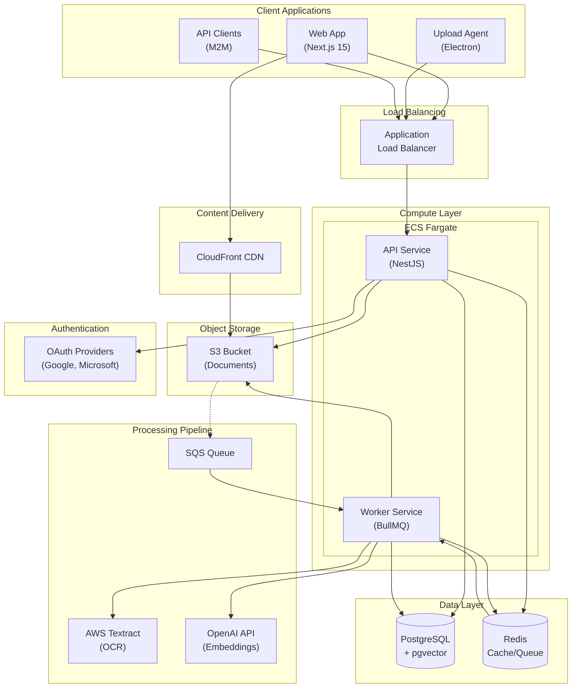
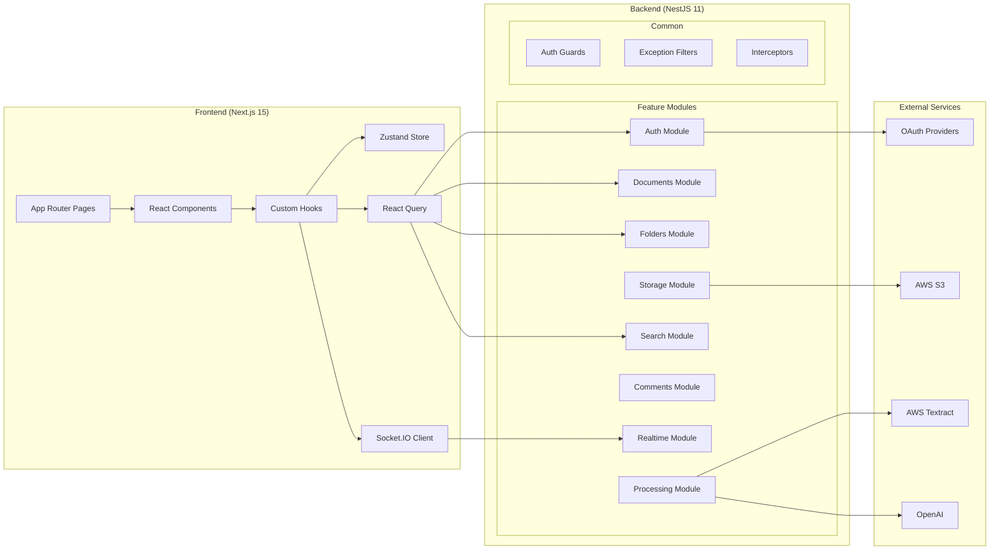
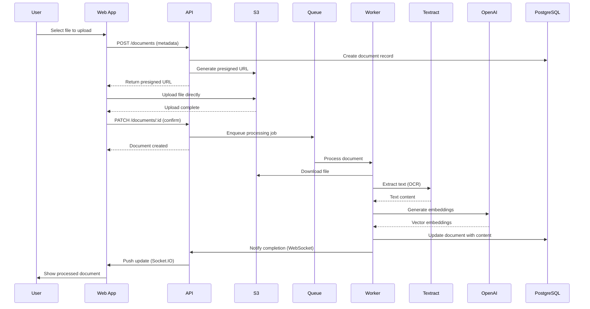
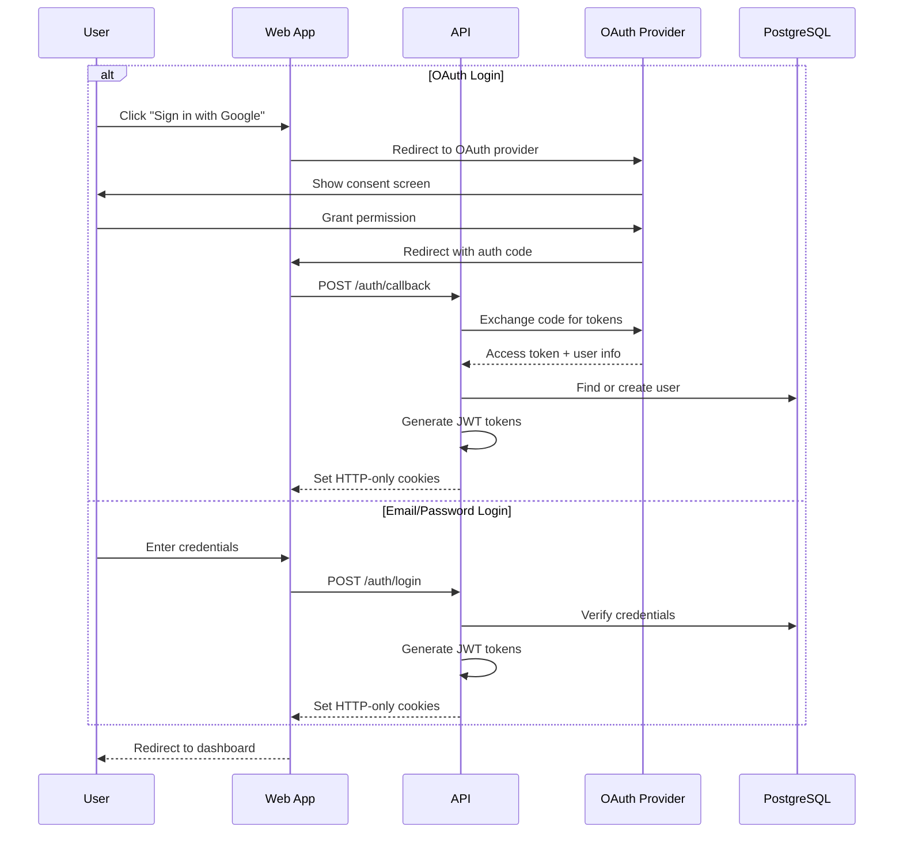
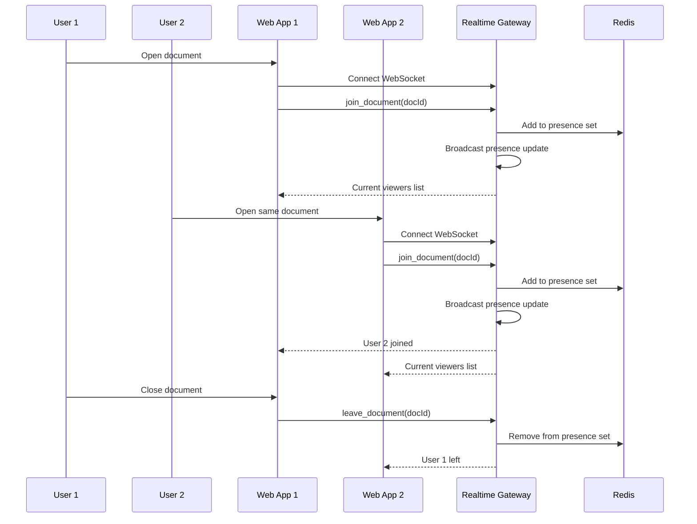
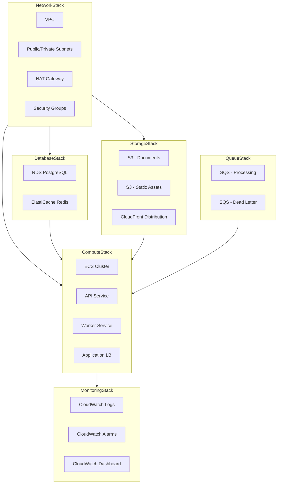
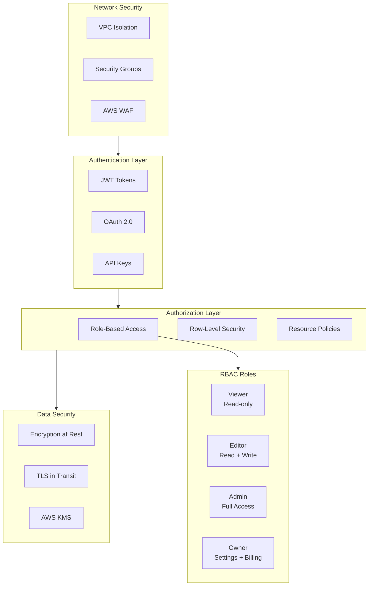

# Document Management System - Architecture

## System Overview

## Component Architecture

## Data Flow - Document Upload

## Authentication Flow

## Real-time Presence

## Infrastructure (AWS CDK)

## Security Model

## Tech Stack Summary

| Layer | Technology | Purpose |
|-------|------------|---------|
| Frontend | Next.js 15 + React 19 | Server-side rendering, App Router |
| UI | shadcn/ui + Tailwind | Component library, styling |
| State | Zustand + React Query | Client state, server state |
| Real-time | Socket.IO | WebSocket communication |
| Backend | NestJS 11 | REST API, WebSocket gateway |
| Queue | BullMQ + Redis | Background job processing |
| Database | PostgreSQL 16 + pgvector | Relational data, vector search |
| Cache | Redis 7 | Session, cache, pub/sub |
| Storage | AWS S3 + CloudFront | File storage, CDN |
| OCR | AWS Textract | Document text extraction |
| AI | OpenAI GPT-4 | Classification, embeddings |
| IaC | AWS CDK v2 | Infrastructure as code |
| CI/CD | GitHub Actions | Continuous integration/deployment |
