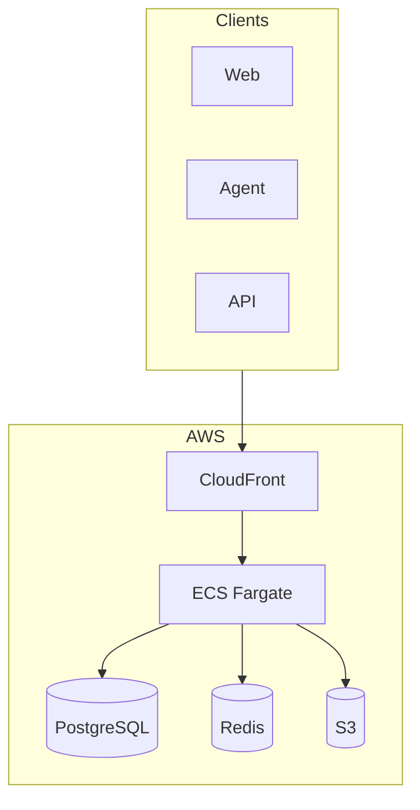
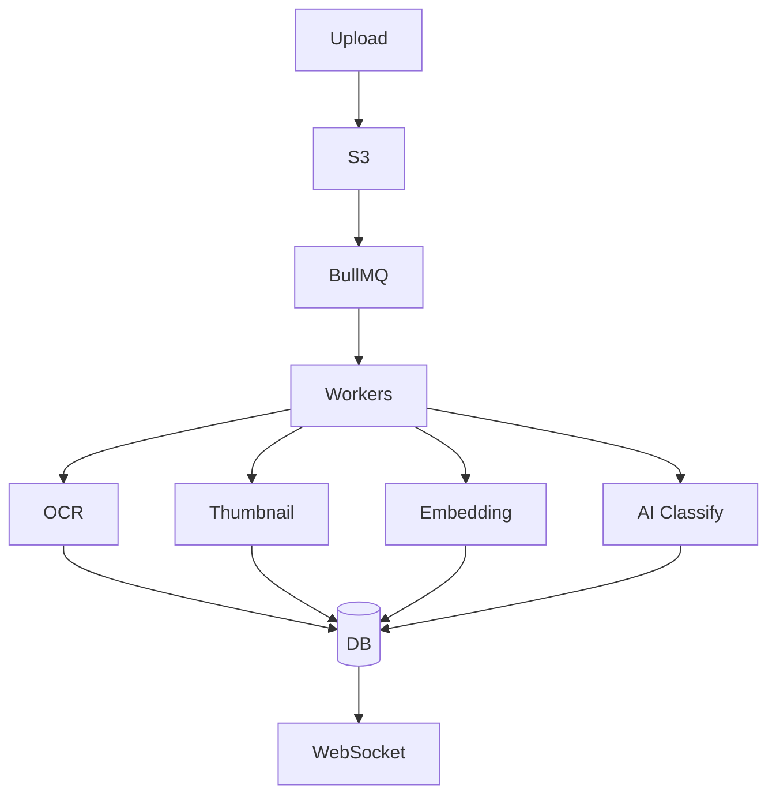

# Document Management System

Cloud-based DMS with AI-powered Processing

<div class="pt-12">
  <span class="px-2 py-1 rounded cursor-pointer" hover="bg-white bg-opacity-10">
    Willian Pinho | Technical Assessment
  </span>
</div>

<!--
[0:00 - 0:20] OPENING

"Hi, I'm Willian Pinho, and in the next 5 minutes I'll walk you through my solution for the Document Management System challenge.

The goal: build a cloud-based document system with AI-powered processing - PDF splitting, OCR, and intelligent classification."
-->

---
transition: fade-out
---

# High-Level Architecture

<div class="grid grid-cols-2 gap-4">

<div class="text-sm">

### Clients

<v-clicks>

- Web App (Next.js 15)
- Desktop Agent (Electron)
- REST API

</v-clicks>

### AWS Cloud:

<v-clicks>

- **ECS Fargate** - Auto-scaling containers
- **PostgreSQL + pgvector** - DB + Vector search
- **S3 + CloudFront** - Storage & CDN
- **BullMQ + Redis** - Job processing

</v-clicks>

</div>

<div>



</div>

</div>

<!--
[0:20 - 1:00] ARCHITECTURE

"Here's the architecture running on AWS.

Three client types: Next.js web app, Electron desktop agent for folder sync, and REST API for integrations.

ECS Fargate for auto-scaling containers. PostgreSQL with pgvector for document data AND semantic search in a single database. Redis for caching and BullMQ job queues. S3 with CloudFront CDN for file storage.

All infrastructure defined as code using AWS CDK v2 in TypeScript - making deployments repeatable and version-controlled."
-->

---
layout: default
---

# Document Processing Pipeline

<div class="grid grid-cols-2 gap-4">

<div>



</div>

<div class="text-sm">

### Processing Jobs

<v-clicks>

- **OCR** - AWS Textract extracts text
- **Thumbnail** - Sharp generates previews
- **Embedding** - OpenAI 1536-dim vectors
- **AI Classify** - GPT-4 categorization

</v-clicks>

### Features

<v-clicks>

- Presigned URLs (direct S3 upload)
- Real-time status via WebSocket
- Auto-retry with dead-letter queue
- Horizontal scaling of workers

</v-clicks>

</div>

</div>

<!--
[1:00 - 1:45] PROCESSING PIPELINE

"When a user uploads a file, it goes directly to S3 using presigned URLs - the API stays lightweight.

Background workers powered by BullMQ then:
- Extract text using AWS Textract for OCR
- Generate thumbnails with Sharp
- Create 1536-dimensional embeddings with OpenAI
- Classify documents automatically using GPT-4

Features
- Presigned URLs (direct S3 upload)
- Real-time status via WebSocket
- Horizontal scaling of workers
- Auto-retry with dead-letter queue

Users see real-time progress through WebSockets. Failed jobs go to a dead-letter queue for retry."
-->

---
layout: default
---

# AI Features: Search & Classification

<div class="grid grid-cols-2 gap-6">

<div>

### Semantic Search

<v-clicks>

1. Document → Text extracted (Textract)
2. Text → Embedding (OpenAI)
3. Embedding → pgvector (1536 dims)
4. Query → Cosine similarity
5. Ranked results returned

</v-clicks>

<div class="mt-4 p-2 bg-green-100 rounded text-green-800 text-sm">
  Search "employee guidelines" → Finds "Company Handbook.pdf" (81% match)
</div>

</div>

<div>

### AI Classification (GPT-4)

```json
{
  "category": "Invoice",
  "confidence": 0.99,
  "tags": ["payment", "billing"],
  "summary": "Invoice for...",
  "language": "en"
}
```

<v-clicks>

**Categories:** Invoice, Contract, Report, Manual, Memo, Legal

**95-99% confidence** on classification

</v-clicks>

</div>

</div>

<!--
[1:45 - 2:30] AI FEATURES

"The AI features are the differentiator.

Semantic search: 
- Document text extracted using Textract
- Text Embedding using OpenAI
- Documents are embedded into 1536-dimensional vectors using OpenAI. 
- When you search 'employee guidelines', it finds 'Company Handbook' with 81% match - understanding meaning, not just keywords.

AI Classification: GPT-4 analyzes each document and returns category, confidence score, relevant tags, and a summary. It correctly identifies invoices, contracts, reports with 95-99% accuracy.

All stored in PostgreSQL with pgvector - one database for everything."
-->

---
layout: default
---

# Technology Stack

| Layer | Technology | Rationale |
|-------|------------|-----------|
| **Frontend** | Next.js 15 + React 19 | SSR, App Router, Performance |
| **Backend** | NestJS 11 | TypeScript, Modular, Enterprise |
| **Database** | PostgreSQL + pgvector | ACID + Vector Search in one DB |
| **Queue** | BullMQ + Redis | Reliable, priorities, scheduling |
| **Storage** | S3 + CloudFront | Scalable, CDN, cost-effective |
| **AI** | OpenAI + AWS Textract | GPT-4 + Enterprise OCR |
| **IaC** | AWS CDK v2 | Type-safe TypeScript |
| **CI/CD** | GitHub Actions | PR checks, auto-deploy |

<!--
[2:30 - 3:15] TECH STACK & CI/CD

"Quick overview of the stack choices:

Next.js 15 for the frontend with React 19 - server components for performance.

NestJS 11 for the backend - modular, TypeScript-native, enterprise-ready.

PostgreSQL with pgvector - this is key: one database for relational data AND vector search. No need to manage Pinecone or separate vector DB.

BullMQ on Redis for reliable job processing with priorities.

AWS CDK v2 for infrastructure as code - everything defined in TypeScript, version-controlled.

GitHub Actions for CI/CD - automated tests on PRs, auto-deploy to staging and production."
-->

---
layout: default
---

# Security & Observability

<div class="grid grid-cols-2 gap-8">

<div>

### Authentication

<v-clicks>

- **Web App**: NextAuth.js with OAuth
  - Google & Microsoft SSO
  - JWT in HTTP-only cookies
- **API**: Bearer tokens (15min / 7day)
- **Upload Agent**: API Key + HMAC
- **RBAC**: Viewer → Editor → Admin → Owner

</v-clicks>

</div>

<div>

### Observability

<v-clicks>

- **Logs**: CloudWatch structured logs
- **Metrics**: Custom CloudWatch metrics
- **Tracing**: AWS X-Ray distributed tracing
- **Alerts**: SLO-based alerting
  - P99 latency < 500ms
  - Availability > 99.9%
  - Error rate < 0.1%

</v-clicks>

</div>

</div>

<!--
[3:15 - 4:00] SECURITY & OBSERVABILITY

"For authentication: NextAuth.js handles OAuth with Google and Microsoft SSO for the web app. JWTs stored in HTTP-only cookies.

The upload agent uses API keys with HMAC signatures for machine-to-machine auth.

Role-based access control with four levels: Viewer, Editor, Admin, Owner.

For observability: CloudWatch for structured logs and custom metrics. AWS X-Ray for distributed tracing across services.

SLO-based alerting: P99 latency under 500ms, 99.9% availability target, error rate under 0.1%."
-->

---
layout: two-cols
---

# Scalability & Cost

### Auto-Scaling

<v-clicks>

- **ECS Fargate** scales on CPU/memory
- **Worker Spot instances** - 70% savings
- **PostgreSQL read replicas**
- **Redis cluster mode**

</v-clicks>

### Development Process

<v-clicks>

- **AI-Assisted**: Claude Code + Copilot
- **Monorepo**: Turborepo for builds
- **Type Safety**: End-to-end TypeScript
- **Testing**: Vitest + Playwright

</v-clicks>

::right::

<div class="mt-8 pl-4">

### Monthly Cost (1000 users)

<div class="text-4xl font-bold text-blue-600 mb-4">$500-800</div>

| Service | Cost |
|---------|------|
| ECS Fargate | ~$200 |
| RDS PostgreSQL | ~$150 |
| ElastiCache Redis | ~$50 |
| S3 + CloudFront | ~$50 |
| AI APIs | ~$100-200 |

<div class="mt-4 p-2 bg-green-100 rounded text-green-800 text-sm">
  70% savings with Spot instances
</div>

</div>

<!--
[4:00 - 4:40] SCALABILITY & DEVELOPMENT

"The system scales horizontally. ECS Fargate auto-scales based on load. Spot instances for workers give 70% cost savings.

For development: I leveraged AI tools heavily - Claude Code for architecture decisions and code generation, GitHub Copilot for faster coding. This accelerated development while maintaining quality through TypeScript end-to-end and automated testing.

Monorepo with Turborepo for efficient builds across web, API, and shared packages.

Cost estimate for 1000 users: $500-800 per month - most going to compute and AI APIs."
-->

---
layout: center
class: text-center
---

# Summary

<div class="grid grid-cols-2 gap-8 text-left max-w-3xl mx-auto mt-8">

<div>

### What I Built

<v-clicks>

- ✅ Production-ready DMS
- ✅ AI-powered semantic search
- ✅ Automatic document classification
- ✅ Real-time collaboration
- ✅ Complete IaC (AWS CDK)

</v-clicks>

</div>

<div>

### 9 Aspects Covered

<v-clicks>

- 🛠️ AI-assisted development
- ☁️ AWS cloud platform
- ⚡ ECS Fargate compute
- 🔄 GitHub Actions CI/CD
- 📊 CloudWatch observability
- 💻 Next.js + NestJS stack
- 📄 BullMQ file processing
- 🔐 OAuth + RBAC auth
- 🐘 PostgreSQL + pgvector

</v-clicks>

</div>

</div>

<div class="mt-8 p-4 bg-blue-100 rounded-lg text-blue-800">
  <strong>Ready for deep-dive discussion!</strong>
</div>

<!--
[4:40 - 5:00] CLOSING

"To summarize: this is a production-ready Document Management System covering all 9 aspects requested.

AI-assisted development with Claude and Copilot. AWS infrastructure with ECS Fargate. GitHub Actions for CI/CD. CloudWatch for observability. Modern stack with Next.js and NestJS. BullMQ for processing. OAuth authentication. PostgreSQL with pgvector for the database.

I'm excited to dive deeper into any of these areas during our interview. Thanks for watching!"
-->

---
layout: end
---

# Thank You!

**Willian Pinho**

Technical Assessment - CultureEngine

<!--
END OF PRESENTATION

Total time: ~5 minutes

Key points covered:
1. Development Process - AI tools (Claude, Copilot)
2. Cloud Provider - AWS
3. Compute/Scalability - ECS Fargate, Spot instances
4. CI/CD & IaC - GitHub Actions, AWS CDK
5. Observability - CloudWatch, X-Ray, SLOs
6. Tech Stack - Next.js, NestJS, etc.
7. File Processing - BullMQ pipeline
8. Authentication - OAuth, JWT, API Keys, RBAC
9. Database - PostgreSQL + pgvector
-->
